# JDeploy System Design Document

This document summarizes a static analysis of the JDeploy codebase and now includes controller/service-level execution models.

## 1) High-Level Architecture

JDeploy uses a **modular monolith backend plus a separate UI service**:

- **`backend-api`**: Spring Boot service exposing REST APIs, service-layer business logic, CLI commands, and operational endpoints.
- **`vaadin-ui`**: separate Spring Boot + Vaadin web app that calls backend REST APIs over HTTP.
- **Neo4j**: primary graph database for topology and deployment relationships.
- **Filesystem artifact storage**: backend persists generated PlantUML artifacts as files with retention metadata.

## 2) Component Breakdown

### Frontend (Vaadin UI)

- Route-driven server-rendered UI for dashboard, ingest, explorer, and diagrams.
- `RestClient` API clients call backend endpoints.
- Supports outbound auth modes (`BASIC`, `PROPAGATE`, `NONE`).

### Backend API

- **Controllers**: `ManifestController`, `TopologyController`, `TopologyQueryController`, `ArtifactController`.
- **Services**: `ManifestParserService`, `ManifestContractValidator`, `ManifestIngestionService`, `TopologyQueryService`, `TopologyMutationService`, `DiagramGenerationService`, `GraphInvariantValidator`, `GraphQualityGateService`, `DeploymentMappingService`, `ArtifactRetentionCleanupService`, `OperationMetricsService`.
- **Security**: HTTP Basic + method-level authorization.

### Database & Artifacts

- **Neo4j graph** nodes include systems/components/deployments/environments/subnets/nodes/clusters/network links.
- **Local artifact storage** keeps generated `.puml` plus `.retention` sidecar timestamps.

## 3) Data Flow and Interactions

### Manifest Ingestion
1. Client submits YAML.
2. Parse into `DeploymentManifestDto`.
3. Validate contract constraints.
4. Synchronize graph via ordered upsert + prune operations.
5. Record metrics and observations.

### Query and Diagram
1. UI/API queries topology or system diagram view.
2. Backend executes Cypher projections.
3. Optionally generate PlantUML and persist artifact.

## 4) Technology Stack and Rationale

- Java 21, Spring Boot, Spring Data Neo4j + Neo4jClient
- Spring Security, Spring Actuator, Micrometer + Prometheus
- Jackson YAML, Picocli CLI, PlantUML
- Vaadin for operator-facing server-side UI

## 5) Key Design Decisions and Trade-offs

1. **Graph-first model**: great for topology traversals; requires Cypher competency.
2. **Separate backend/UI processes**: independent deployment; more operational complexity.
3. **Cypher-heavy services**: high control and explicitness; less abstraction than repository-only patterns.
4. **In-memory role users from env**: simple bootstrap; weaker enterprise IAM integration.
5. **Filesystem artifact storage**: low complexity; not ideal for multi-instance HA.

## 6) Scalability, Security, Deployment Considerations

### Scalability
- Backend is largely stateless, but scheduled jobs and local artifact files need multi-replica coordination.
- Neo4j capacity and indexing are primary throughput constraints.

### Security
- Role-based endpoint and method authorization is enforced.
- Recommended future hardening: centralized identity/OIDC, managed secret rotation, careful auth-propagation usage.

### Deployment
- Local (Maven / Docker Compose), containerized backend image, Kubernetes manifests for backend+Neo4j+secrets.

---

## 7) Backend API Controller Design (Sequence + Pseudocode)

> Notes:
> - Each controller section shows a representative sequence for its primary workflow.
> - Exact endpoints vary by method; pseudocode summarizes core control flow.

### 7.1 `ManifestController`

#### Sequence (manifest ingest)
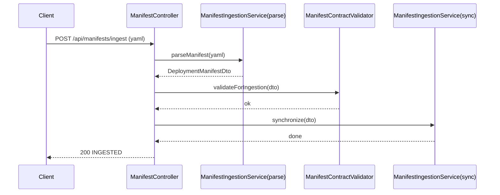

#### Pseudocode
```text
ingest(yaml):
  manifest = ingestionService.parseManifest(yaml)
  contractValidator.validateForIngestion(manifest)
  ingestionService.synchronize(manifest)
  return OperationResult("INGESTED", ...)

qualityGateManifest(yaml):
  manifest = parse
  validate contract
  return OperationResult("PASSED", ...)

qualityGateDeploymentTargets(yaml):
  manifest = parse
  validate contract
  return OperationResult("PASSED", ...)

qualityGateGraphSnapshot():
  snapshot = graphQualityGateService.latestReport()
  return snapshot
```

### 7.2 `TopologyController`

#### Sequence (update node)
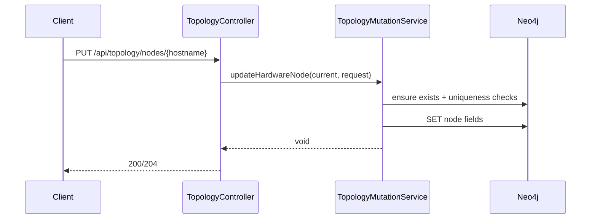

#### Pseudocode
```text
systems()/hardwareNodes()/subnets()/environments():
  run Cypher projection via Neo4jClient
  map rows to response records

system(name)/node(hostname)/subnet(cidr)/environment(name):
  query by identifier
  if missing -> 404
  map to update DTO

update*/patch* endpoints:
  delegate to mutationService with path id + validated request
```

### 7.3 `TopologyQueryController`

#### Sequence (impact by node)
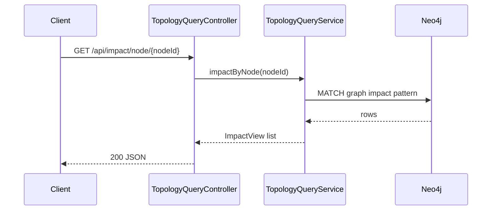

#### Pseudocode
```text
deploymentsBySubnet(subnetId):
  return topologyQueryService.deploymentsBySubnet(subnetId)

deploymentsInSubnet/deploymentsInSubnetQuery:
  reuse deploymentsBySubnet()

impactByNode(nodeId):
  return topologyQueryService.impactByNode(nodeId)

nodesInCluster / nodesInClusterAndSubnet:
  run direct Cypher query with Neo4jClient

systemDiagram(systemId):
  view = topologyQueryService.systemDiagram(systemId)
  return transformed view

systemsImpactedByNodeFailure(nodeId):
  run direct Cypher
  map impacted components by system
```

### 7.4 `ArtifactController`

#### Sequence (generate artifact)
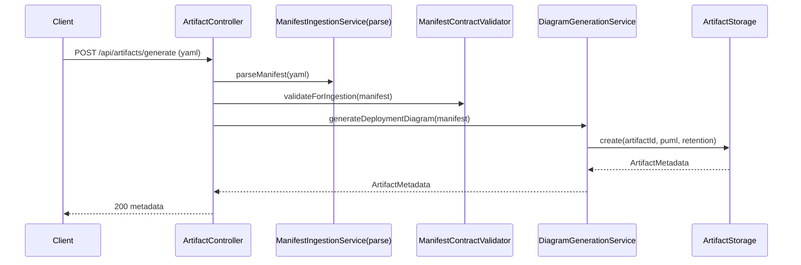

#### Pseudocode
```text
generate(yaml):
  manifest = ingestionService.parseManifest(yaml)
  contractValidator.validateForIngestion(manifest)
  return diagramGenerationService.generateDeploymentDiagram(manifest)

download(artifactId):
  try artifactStorage.read(artifactId)
  map not found -> 404
  map expired -> 410
  return bytes with content-disposition
```

---

## 8) Backend Service Design (Sequence + Pseudocode)

### 8.1 `ManifestParserService`

#### Sequence
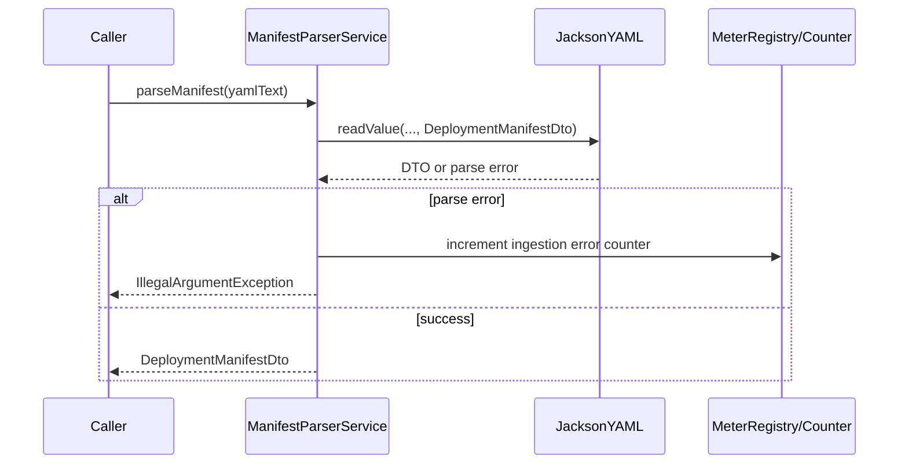

#### Pseudocode
```text
parseManifest(yamlText):
  require non-null/non-blank
  try parse with yamlMapper
  if null -> postcondition error
  return dto
  catch parse exception -> increment counter; throw argument error

parseManifest(path):
  read file text
  delegate parseManifest(text)
```

### 8.2 `ManifestContractValidator`

#### Sequence
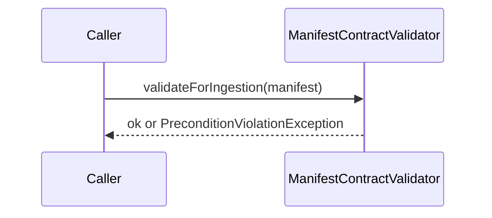

#### Pseudocode
```text
validateForIngestion(manifest):
  require manifest and at least one system
  assert unique environments
  collect hosts/ips from subnets and ensure uniqueness
  validate cluster names + referenced nodes + unique namespaces
  validate systems/components uniqueness and ownership
  validate each deployment references existing env/host/cluster/namespace rules
  validate network links reference existing hosts
```

### 8.3 `ManifestIngestionService`

#### Sequence
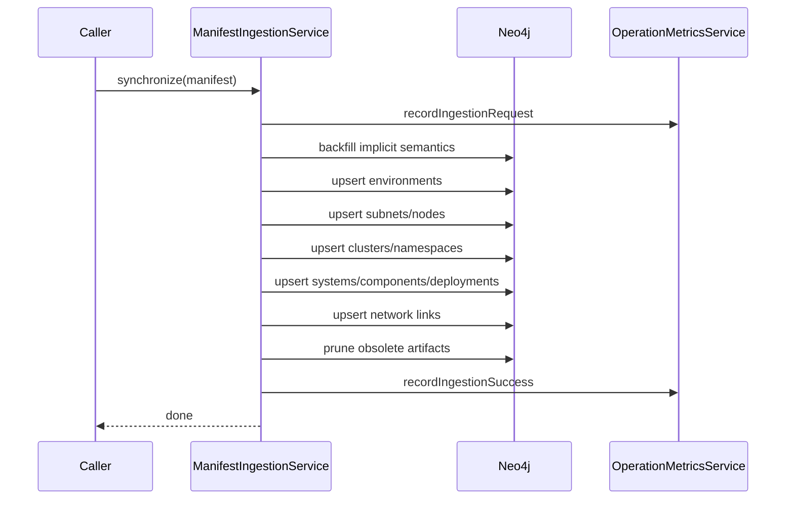

#### Pseudocode
```text
parseManifest(yaml|path):
  delegate to parserService
  ensure non-null result

synchronize(manifest):
  require manifest
  record request metric
  observe synchronizeManifest(manifest)
  on success -> record success metric
  on runtime error -> record error metric and rethrow

synchronizeManifest(manifest):
  backfillImplicitClusterSemantics()
  upsertEnvironments()
  upsertSubnetsAndNodes()
  upsertClusters()
  upsertSystemsComponentsAndDeployments()
  upsertNetworkLinks()
  pruneObsoleteArtifacts()
```

### 8.4 `TopologyQueryService`

#### Sequence
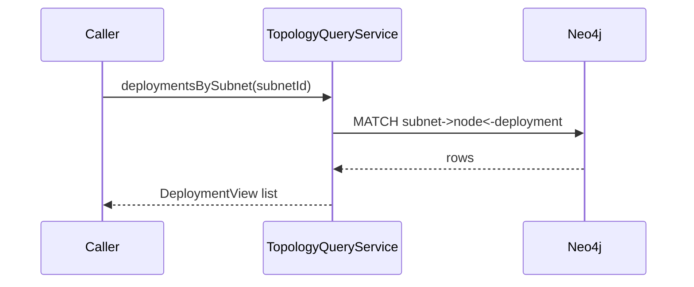

#### Pseudocode
```text
deploymentsBySubnet(subnetId):
  require subnetId
  run Cypher and map hostname/deploymentKey

impactByNode(nodeId):
  require nodeId
  run Cypher for component/deployment/peer node/cluster impact
  map collection fields to string lists

systemDiagram(systemId):
  require systemId
  query components for system
  query distinct target nodes
  return SystemDiagramView(systemId, components, nodes)
```

### 8.5 `TopologyMutationService`

#### Sequence
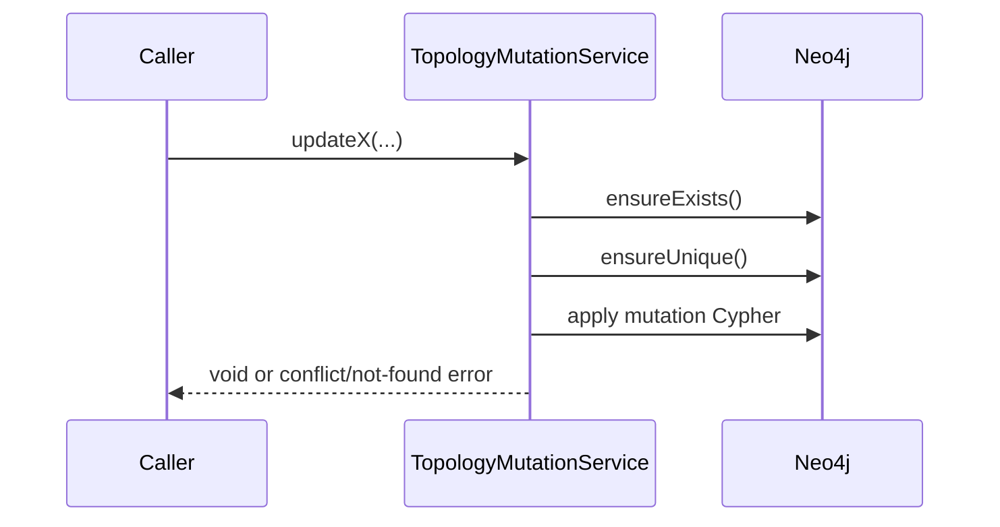

#### Pseudocode
```text
updateSoftwareSystem(existingName, req):
  ensure system exists
  ensure target name unique
  mutate name

updateSoftwareComponent(currentName, currentVersion, req):
  ensure exists
  ensure name/version combination unique
  set new name/version

updateHardwareNode / updateSubnet / updateExecutionEnvironment:
  ensure exists
  ensure uniqueness constraints
  set fields

updateDeploymentInstance(currentKey, req):
  ensure deployment, env, node exist
  derive component identity from relationship or key parse
  compute new canonical key env@host:component:version
  ensure key unique
  replace target relationships + set new key
```

### 8.6 `DiagramGenerationService`

#### Sequence
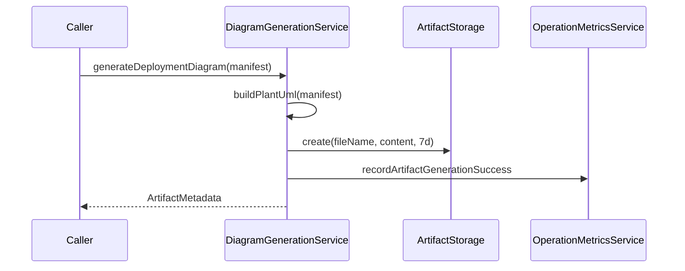

#### Pseudocode
```text
generateDeploymentDiagram(manifest):
  require manifest
  observe:
    puml = buildPlantUml(manifest)
    artifactId = "deployment-topology-<epoch>.puml"
    metadata = artifactStorage.create(artifactId, puml, 7 days)
    ensure metadata non-null
    record success metric
    return metadata
  catch runtime:
    record error metric
    rethrow

buildPlantUml(manifest):
  emit @startuml headers
  render subnets and nodes (optionally grouped by cluster)
  render systems/components/artifacts/deployment arrows
  render network links and legend
  emit @enduml

buildSystemPlantUml(systemId):
  query system diagram context
  render system->components and target node cloud
```

### 8.7 `GraphInvariantValidator`

#### Sequence
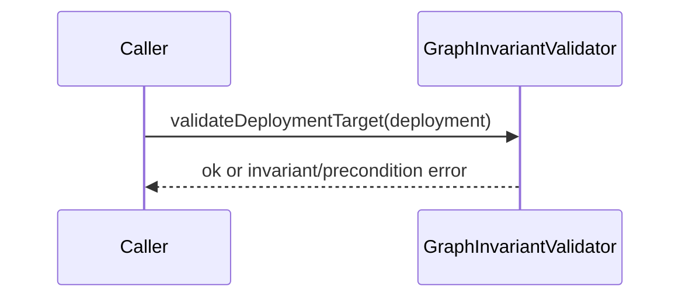

#### Pseudocode
```text
validateDeploymentTarget(deployment):
  require deployment
  require target environment and target node present
  require non-blank deployment key

validateSubnetMembership(subnet, node):
  require subnet and node
  ensure node hostname exists in subnet node set

requireClusterNodeRole(node):
  require node
  ensure node roles contains grid or kubernetes
```

### 8.8 `GraphQualityGateService`

#### Sequence
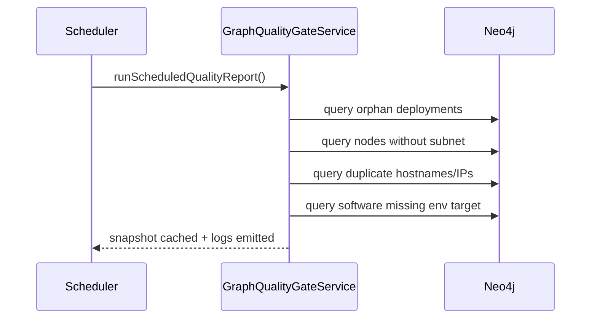

#### Pseudocode
```text
evaluateGraph():
  query findings lists for:
    orphanDeployments
    nodesWithoutSubnet
    duplicateHostnames
    duplicateIps
    softwareLinkedToMissingEnvironment
  return QualityGateReport(map)

runScheduledQualityReport():
  if reporting disabled -> return
  snapshot = evaluateAndStore()
  log pass or warn with finding counts

latestReport():
  return cached snapshot or evaluateAndStore()
```

### 8.9 `DeploymentMappingService`

#### Sequence
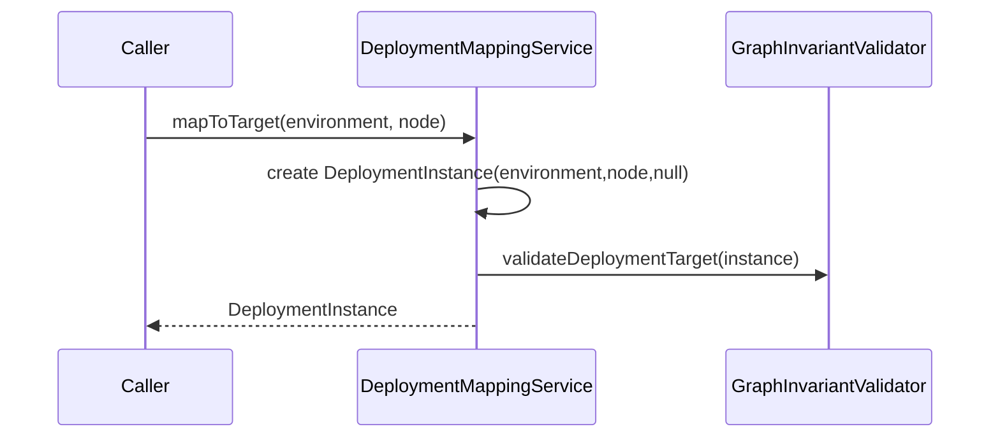

#### Pseudocode
```text
mapToTarget(environment, node):
  require environment and node
  instance = new DeploymentInstance(environment, node, null)
  graphInvariantValidator.validateDeploymentTarget(instance)
  assert instance targets exactly provided inputs
  return instance
```

### 8.10 `ArtifactRetentionCleanupService`

#### Sequence
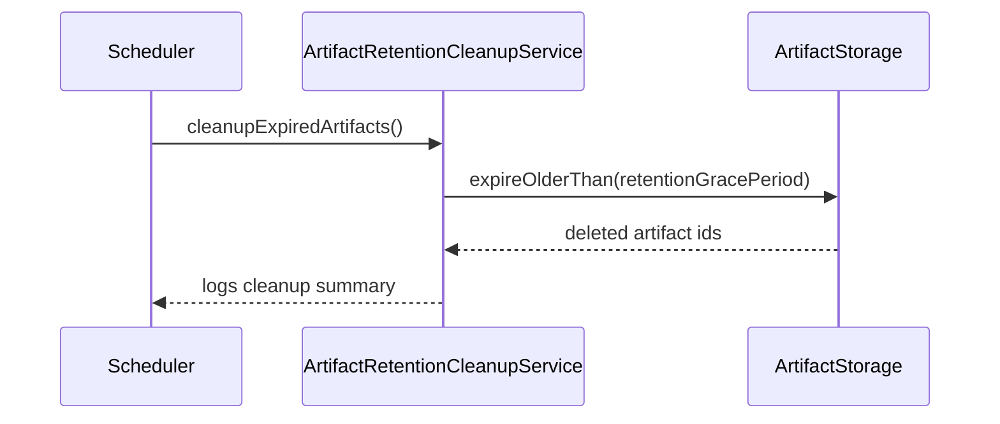

#### Pseudocode
```text
cleanupExpiredArtifacts():
  deleted = artifactStorage.expireOlderThan(retentionGracePeriod)
  if deleted not empty -> log deleted list
```

### 8.11 `OperationMetricsService`

#### Sequence
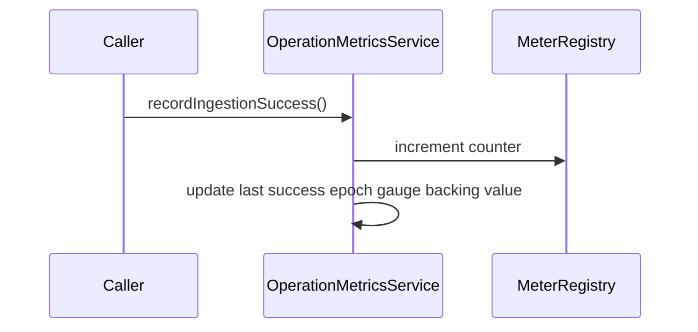

#### Pseudocode
```text
constructor(meterRegistry):
  register counters for ingestion/artifact success+error
  register gauges for last success timestamps

recordIngestionRequest/Success/Error():
  increment relevant counter
  update timestamp for success

recordArtifactGenerationSuccess/Error():
  increment relevant counter
  update timestamp for success

snapshot():
  return map of current counters and timestamp values
```

---

## 9) Global Diagram Suggestions

### Runtime Topology

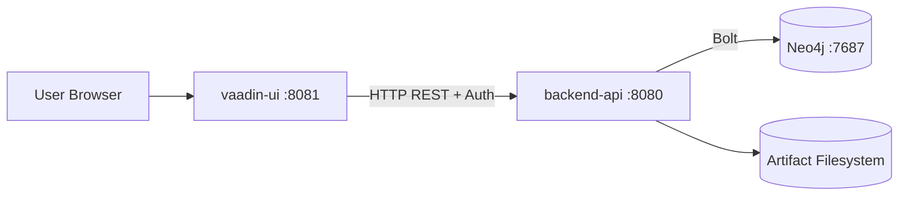

### Backend Layering

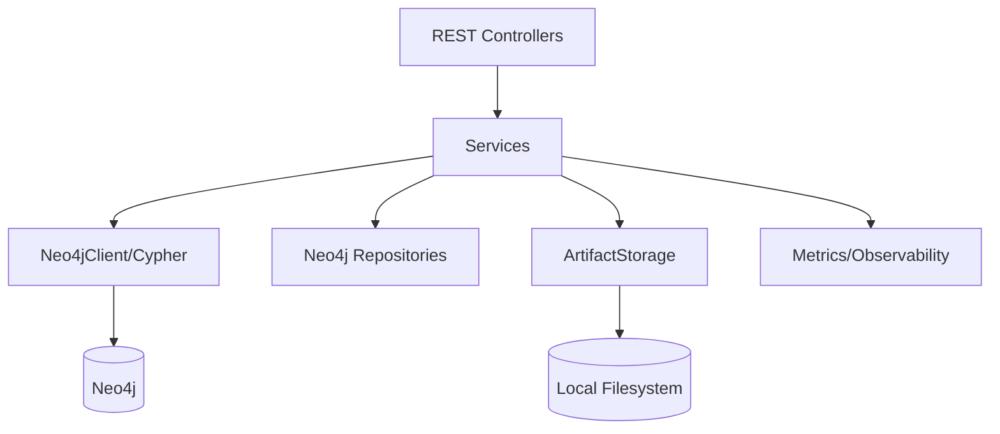
